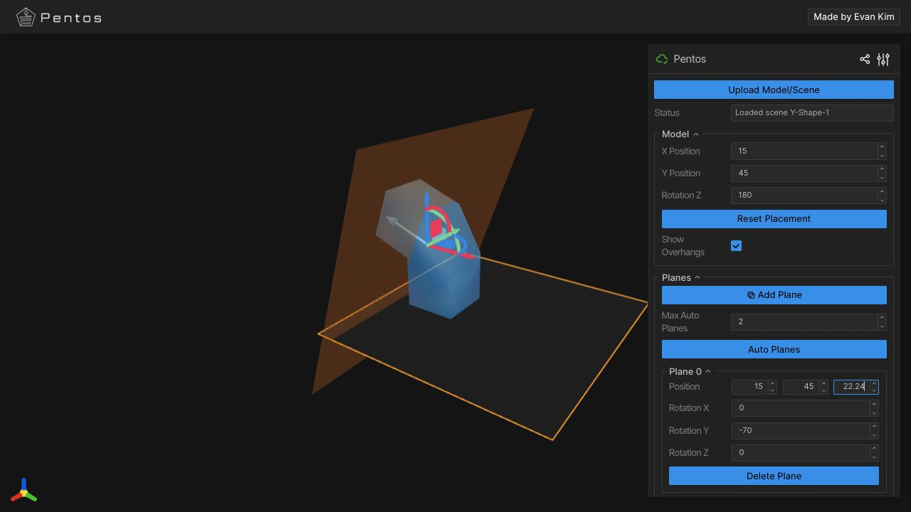
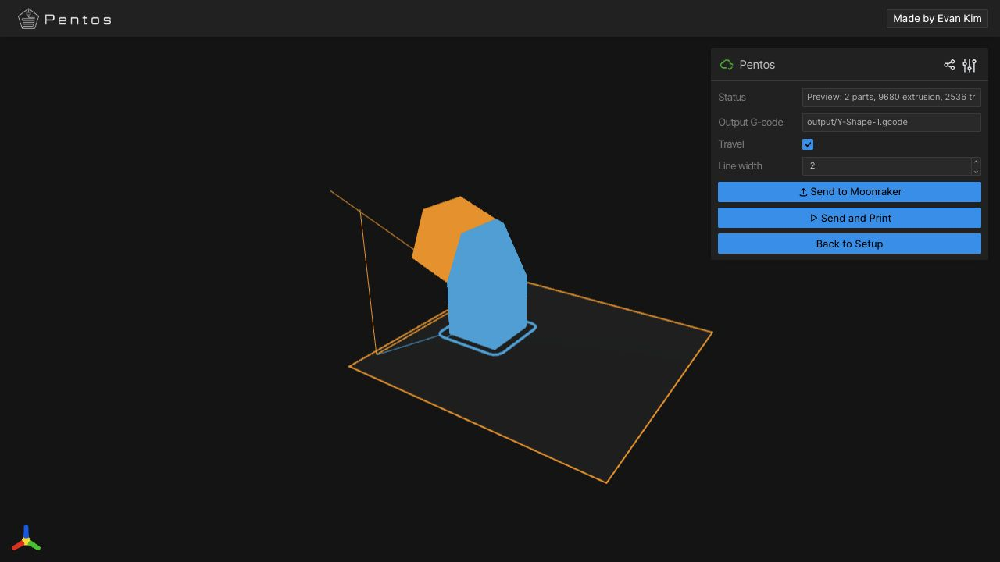

# Pentos Slicer

Pentos Slicer is a small Python 3.13 web UI for preparing a model, placing
interactive slice planes, exporting oriented STL chunks, running PrusaSlicer,
and merging the generated G-code with Pentos A/B transition moves.

The app uses [Viser](https://viser.studio/) for the browser-based 3D interface
and `trimesh` for model loading and geometry operations.

## Demo

<table>
  <tr>
    <td width="50%">
      
    </td>
    <td width="50%">
      
    </td>
  </tr>
  <tr>
    <td align="center"><em>Place and orient interactive slice planes</em></td>
    <td align="center"><em>Preview the generated multi-part toolpath</em></td>
  </tr>
</table>

## Requirements

- Python 3.13
- `uv`
- `prusa-slicer` available on `PATH` when running the full slicing pipeline

Install the Python environment:

```bash
uv sync
```

## Run

Start the local Viser app:

```bash
uv run python main.py
```

Open the URL printed in the terminal, usually:

```text
http://localhost:8080
```

Or build and run it with Docker:

```bash
docker build -t pentos-slicer .
docker run --rm -p 8080:8080 pentos-slicer
```

At most two models are sliced concurrently by default. Set
`MAX_CONCURRENT_SLICES` to a positive integer to change that limit.
Uploads are limited to 50 MB by default. Set `MAX_UPLOAD_SIZE_MB` to a positive
integer to change that limit.

## Basic Workflow

1. Upload a model (`.stl`, `.3mf`, `.obj`, or `.ply`).
2. Add one or more slice planes.
3. Move or rotate planes with the viewport gizmo or GUI controls.
4. Click **Slice**.
5. The app switches to a preview shell showing the generated G-code path.
6. Click **Back to Setup** to return to the model and plane controls.

Sample models are available in `samples/`.

## Project Layout

- `main.py` starts the Viser server and mounts the application controller.
- `models/` stores shared application state, plane snapshots, and preview data.
- `controllers/` coordinates setup, preview, slicing, export, and navigation.
- `views/` contains the Viser UI, scene rendering, plane editor, and theme.
- `services/` contains model/project I/O, preview parsing, auto-plane selection,
  and slicing.
- `gcode_tools/` trims and merges generated G-code with Pentos transitions.
- `machine.py` stores machine geometry constants.
- `samples/` contains example models and saved Pentos scenes.

Generated runtime files are written to `uploaded_models/`, `temp/`, and
`output/`. These are local outputs and should not be committed.

## App Structure

`AppController` is the composition root. It creates the shared `AppState`,
services, screen controllers, and views:

- Models hold data independently of Viser and external processes.
- Controllers mutate application state and coordinate services.
- Services perform geometry, filesystem, slicing, parsing, and network work.
- Views create Viser handles, render state, and forward user actions.

Plane edits update controller-owned snapshots as they happen. Runtime plane IDs
are not included in version-1 `.pentos` manifests, so existing scenes remain
compatible.

## Development Checks

Format touched Python files:

```bash
uv run ruff format .
```

Run tests and a quick syntax check:

```bash
uv run pytest
uv run python -m compileall .
```

For visible UI changes, run the app, load a sample model, add a plane, and
exercise the setup-to-preview flow.
